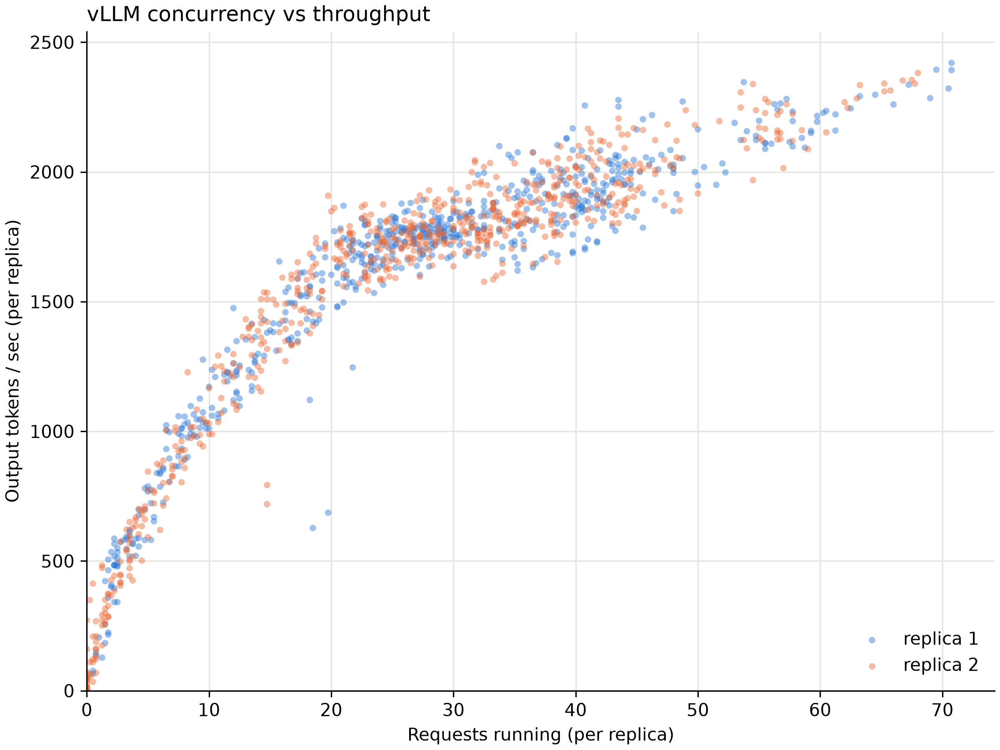
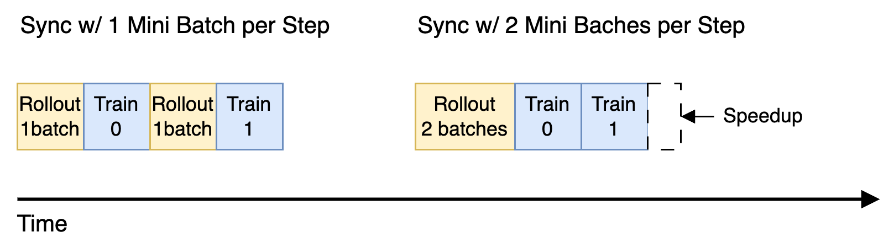
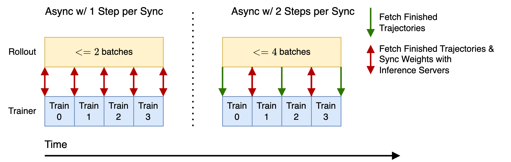
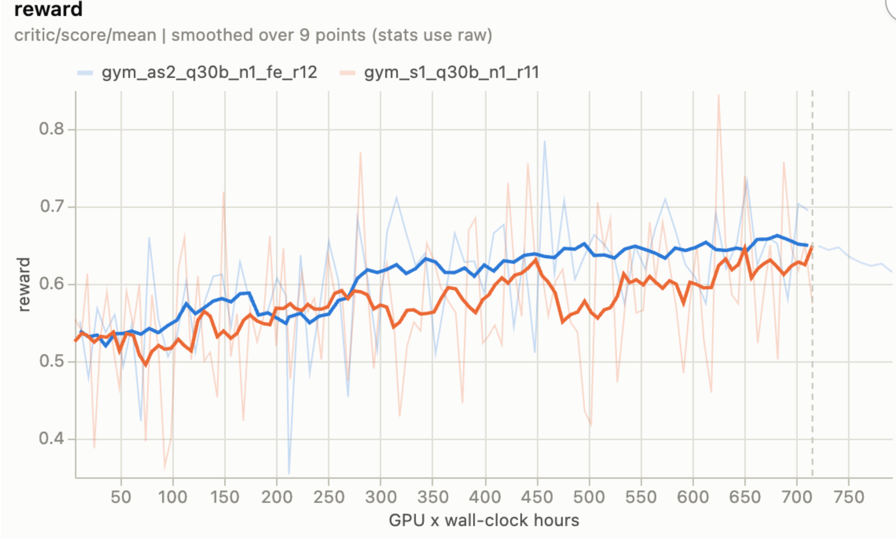
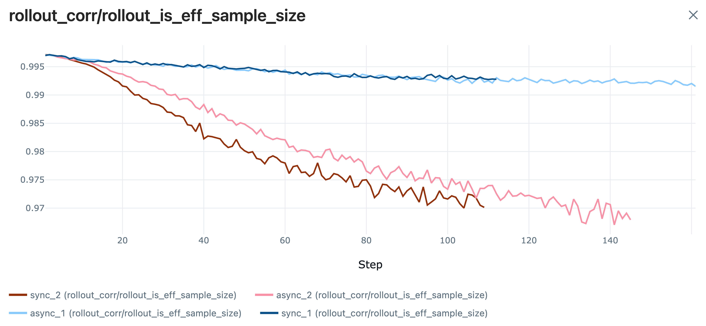

_By [Danylo Vashchilenko](https://github.com/hellodanylo) · October 13, 2026_

:::note[TL;DR]
* 🚀 While training [SWE Gym](../../examples/openhands-swegym-agent) agent, we show that asynchronous RL enables higher learning throughput, leading to ~22% higher reward improvement per GPU-hour of training.
* ℹ️ We show that the efficiency increase is explained by higher LLM inference concurrency and throughput.
* ⏭️ We observe that KV cache remains underutilized (time-average at ~25%), which is an opportunity for further optimization.
:::

## RL Throughput and Concurrency of Inference and Training

All other things being equal, we prefer an RL system with higher throughput per GPU, as measured in processed trajectories per GPU-hour.
In highly parallel systems, **throughput and concurrency are positively correlated** up to a certain level of concurrency (the saturation point).
Measuring and maximizing concurrency is the primary method of optimizing the RL training system.

For the inference servers, KV cache capacity of GPU memory is the bottleneck in SWE and other long-context tasks.
For example, for Qwen3 Coder 30B on p6 node, there is ~5M tokens of capacity, which is only 78 trajectories at 64K context.
However, the actual concurrency can be significantly lower than the capacity.
For example, inference concurrency typically peaks right after a rollout batch is dispatched
and reaches a low right before the next rollout batch is dispatched. When the distribution
of the trajectory-level latency has high variance, the tail can significantly
reduce the actual concurrency and therefore inference throughput. In this scenario,
increasing rollout batch size through off-policy training can improve inference throughput.

For example, the following plots show the inference concurrency (x-axis)
and throughput (y-axis) over the span of a training run. We see
that the variance of throughput is directly explained by the changes in concurrency.

In this report, we will specifically compare (1) 1 mini-batch per step (less off-policy), and (2) 2 mini-batches per step (more off-policy).
We expect that **increasing mini-batch count per step will increase rollout throughput**, because higher inference concurrency will bring the hardware closer to the utilization saturation point.

For the training servers, GPU memory (activations, gradients, optimizer state) is also the bottleneck, but the token batch size is typically significantly higher than the saturation point, so the latency of the update step is roughly linear in the count of tokens. For long trajectories, the training server typically needs [memory saving methods](https://docs.nvidia.com/nemo/megatron-bridge/latest/performance-guide.html) like Model/Context Parallelism, Activation Recomputation and Offloading, which reduce throughput. Quantization can significantly improve throughput if it allows to turn off the memory saving methods without hitting OOMs.
Notably, context compression during rollout can improve the training server's efficiency,
because it only needs enough GPU memory to handle the longest *sequence*, not the longest trajectory.

It's previously been widely discussed that **RL is rollout-bound, but that's not always true for multi-turn RL** like SWE. The inference server encodes the new context tokens (e.g. prompt and tool responses) in parallel and decodes the agent response tokens sequentially. The training server encodes all tokens in parallel, but also does the backward pass for each token. Therefore, the rollout throughput is positively correlated with the non-agent fraction of tokens in the context, while the trainer throughput does not depend on this ratio.

| Server | Agent Tokens | Environment Tokens |
| --- | --- | --- |
| Training | parallel fwd+bwd | parallel fwd+bwd |
| Inference | sequential fwd (slower) | parallel fwd (faster) |

What we observe in this report's training scenario (Qwen3 Coder 30B on SWE Gym) is that in an average trajectory only ~20% of tokens are from the agent.
In this regime, the **inference and training servers can have roughly the same throughput per GPU**.

In short, the bottleneck is an async RL pipeline depends on many characteristics of the workload, but it's certainly not always rollout-bound.
This observation is highly important for prioritizing training efficiency research, and for allocating hardware resources between training and inference servers in experiments.

Using the framework of this section, we expect the disaggregated cluster to have higher throughput than a colocated cluster, because reducing inference servers count increases the effective inference concurrency. And we expect the async RL pipeline to have higher throughput than sync RL pipeline, because rollout batches can overlap, leading to higher inference concurrency.

With the knowledge that the inference and trainer throughput are roughly the same, we choose to have 1:1 ratio of GPUs allocated to trainer and rollout in the disaggregated cluster. We will specifically compare (1) a colocated cluster with 2 hybrid model replicas and (2) a disaggregated cluster with 1 training replica and 1 inference replica.

## Training Results

First, let's review the trainer and rollout throughput measurements of these configurations. As expected, we observe a significant throughput speedup (up to ~1.42x) from using off-policy and async RL, which is explained by the increase of average inference request concurrency. In the sync-1 baseline, the average concurrency of ~11 does not saturate the GPU throughput. Additionally, we observe that average KV cache utilization in all cases is <25%, which means that there is 4x headroom for higher concurrency, which is an opportunity for further optimization.

| **Training Cluster Config** | **Throughput (kilo-tokens/minute/GPU)** | **Throughput Speedup** | **Inference Concurrency per Replica** |
| --- | --- | --- | --- |
| Sync 1 step | 27.82 | 1 | 11.03 |
| Sync 2 steps | 34.47 | 1.24x | 15.20 |
| Async 1 step | 38.49 | 1.38x | 33.97 |
| Async 2 steps | 39.39 | 1.42x | 38.22 |

We know from the past RL research that off-policy learning can be less efficient per optimizer step, so next we measure whether reward
has the same rate of change per 100 optimizer steps. We observe that Async-1 and Sync-2 configurations reduce the rate of reward improvement, while Async-2 configuration increases it.

| **Training Cluster Config** | **Reward Improvement Rate (per 100 optimizer steps)** | **Reward Improvement Speedup** |
| --- | --- | --- |
| Sync 1 step | 5.98pp | 1 |
| Sync 2 steps | 5.71pp | 0.96x |
| Async 1 step | 4.55pp | 0.76x |
| Async 2 steps | 7.79pp | 1.30x |

Finally, we would like to combine the two parts of this analysis -- throughput per GPU and reward improvement rate -- giving us a measurement of the reward change per GPU-hour. In the following table, we calculate the reward's rate of change per 640 GPU-hours. We observe that Async-2 configuration learns 1.22x faster and cheaper than the Sync-1 baseline.

| **Training Cluster Config** | **Reward Improvement Rate (per 640 GPU-hours)** | **Reward Improvement Speedup** |
| --- | --- | --- |
| Sync 1 step | 7.17pp | 1 |
| Sync 2 steps | 7.86pp | 1.10x |
| Async 1 step | 7.05pp | 0.98x |
| Async 2 steps | 8.73pp | 1.22x |

We plot the learning curve of the Sync-1 and Async-2 training runs against the GPU-hours used to observe that Async-2 configuration has been ahead of the Sync-1 run during most of the training runtime.

## Rollout Correction

In this report, we used Verl's implementation of [rollout correction](https://verl.readthedocs.io/en/latest/algo/rollout_corr.html)
with the following parameters: token-level importance ratio, masking threshold of 2, decoupled mode.

In order to understand the off-policy dynamics of these training runs,
we plot the effective non-masked ratio of tokens in each training step, as reported by Verl.
We observe that the ratio of masked tokens grows faster for 2-step configurations
than for 1-step configuration. Notably, up to 3% of tokens are masked towards
the end of the training runs for Sync-2 and Async-2 configurations.

In conclusion, training stability remains an important measurement
in asynchronous and off-policy RL, and further counter-measures might be needed in longer runs.
