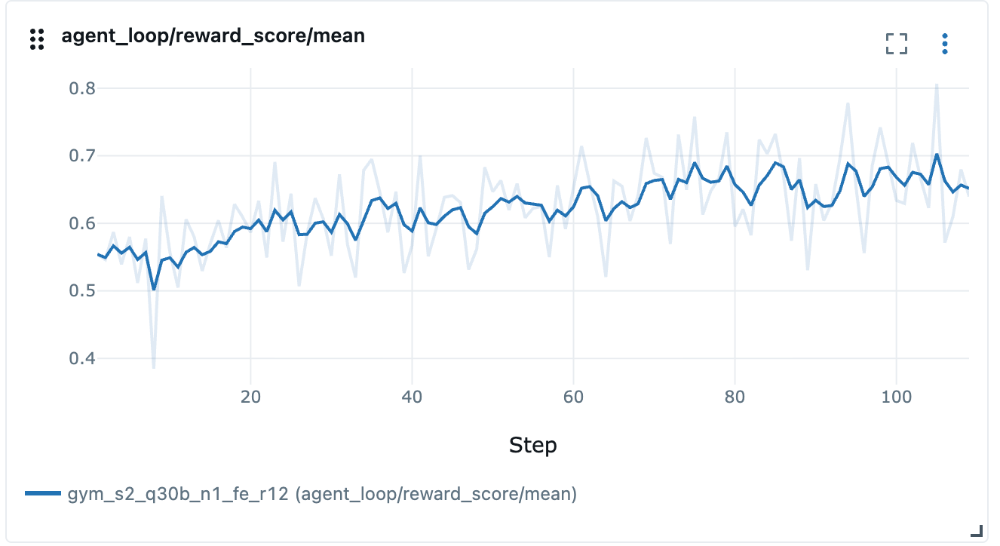

_By [Danylo Vashchilenko](https://github.com/hellodanylo) · October 13, 2026_

:::note[TL;DR]

* 🚀 We train Qwen3 Coder 30B on SWE Gym with GRPO and achieve +8.23pp pass@1 rate improvement.
* 🚀 For training efficiency, we hide the container and environment setup latency 
with a two-stage pipeline and achieve 1.20x inference RPM speedup.
* ✅ We run a cheap self-consistency check for the task verifier, and find that
~15% of tasks in SWE Gym are not aligned with the reward definition. We exclude them from training.
* 🍰 In an ablation, we find that revealing the hidden SWE Gym tests to Qwen3 Coder 30B 
increases the fraction of tasks with reward variance (non-zero advantage) by 27%.

:::

## Motivation and Results
Coding tasks and agents are on the intelligence frontier of the modern LLMs.
The industry is closely monitoring the SWE benchmark results,
such as those aggregated by [Artificial Analysis](https://artificialanalysis.ai/agents/coding-agents).

We designed and implemented an SWE agent that can be used to solve tasks 
from the [SWE Gym](https://github.com/SWE-Gym/SWE-Gym) dataset during RL training and evaluation. 
In order to show the agent's effectiveness, we evaluate [Qwen3 Coder 30B](https://huggingface.co/Qwen/Qwen3-Coder-30B-A3B-Instruct) 
and [Claude Sonnet 4.6](https://docs.aws.amazon.com/bedrock/latest/userguide/model-card-anthropic-claude-sonnet-4-6.html), and then train Qwen3 Coder 30B.

## Agent Design

The agent's core loop is built with OpenHands SDK, which is one of the top-performing
harness SDKs benchmarked on [SWE Bench](https://www.swebench.com/).
We make three built-in tools available: a persistent shell, a file editor,
and a finish tool, which the agent can use to explicitly terminate the loop.

The SWE workflow consists of three stages: (1) setup (preparing the task's environment),
and (2) run (active LLM inference and tool execution), and (3) verification. During the setup stage,
the harness downloads the task-specific dependencies and code (see [Task Environment](#task-environment)).
During the run stage, we use [LiteLLM](https://docs.litellm.ai/) to support
a wide range of LLM servers, including Amazon Bedrock. Finally, during verification,
the harness executes a set of dataset-provided tests and compares their 
pass/no-pass status to the expected outcome (see [Verifier Design](#verifier-design)).

We use the [A2A protocol](https://a2a-protocol.org) to programmatically communicate 
with the agent over HTTP when its hosted on AgentCore Runtime.

During training and evaluation, the agents will need to access many images quickly, 
which could be enough to hit a public registry's pull-rate limits. 
The setup script pulls through an [ECR caching layer](https://docs.aws.amazon.com/AmazonECR/latest/userguide/pull-through-cache.html) 
instead, so only the very first pull of a given task image goes out to the origin registry; every
rollout after that hits the ECR cache.

## Hiding Setup Latency with Warm Pool

The following plots presents the breakdown of latency of different stages,
which shows that "Rate Limit Wait", "AgentCore Setup", and "Task Setup" can take 
almost twice as much time as the Agent Run stage (LLM inference and tool calling, verifier script). 

In order to hide the setup latecy, we implement a two-stage pipeline, where containers
do not acquire a rollout concurrency slot until the setup stage is finished.
The containers that finished setting up but do not have a rollout slot yet are
said to be in the warm pool. When rollout batch size is higher than rollout concurrency
limit, some containers will be fully ready when a concurrency slot becomes available, 
making the setup latency hidden from the inference server's perspective.
In our training runs, the rollout batch size was 512, and we only had enough 
KV cache capacity for 256 concurrent trajectories, but we had enough CPU capacity 
for 512 containers, allowing us to keep up to 256 containers in the warm pool. 
The following table shows performance comparison with and without the warm pool:

|Warm Pool Size|Avg Inference Concurrency|Avg Inference RPM|Inference Speedup|
|---|---|---|---|
|Zero (baseline)|116|1900||
|256 (proposed)|220|2276|1.20x|

We observe that hiding the setup latency increases the inference RPM by 1.20x.

## Task Environment

Each task in the dataset ships as a container image that has a working
Python environment and a checkout of the target repository at the buggy commit. 
For security reasons, AgentCore Runtime is a very restricted environment that
prevents docker pull/run commands. Instead, the setup script directly downloads 
the image's layers, flattens them into a plain root filesystem without ever invoking a
container runtime, and copies just the directories the agent actually needs (the
Python environment and the git repo worktree) into place, discarding the rest. In short,
the task enviroment's filesystem is merged in the agent's root filesystem.

The original intention of authors of SWE Gym datasets was to keep the new tests
away from the agent until it finishes implementing the fix based on a short English
description of the problem. This represents a scenario where the user
provides the agent with task description and then verifies its work with the 
tests that the user develops independently from the agent. However, we found
that some tasks had descriptions that were not aligned with the tests,
making solving the task very hard or even impossible.

As an ablation, we tested the scenario, where the agent can see
both the English description of the problem as well the new tests that will
be used to verify the solution. See [Baseline Evaluation](#baseline-evaluation)
for details on how this impacts the pass rate.

## Verifier Design

Verification starts with writing the task's new test coverage into the worktree and
executing the test suite. This log carries the exact 
markers the verifier's parser looks for. It maps the raw test output onto the specific 
tests each task declares as "must be passing", resulting in single resolved/unresolved verdict.

Two baseline configurations exist to validate the verifier's alignment with the dataset.
The "oracle" baseline applies the dataset's golden patch and expects a resolved verdict; 
the "noop" baseline does not modify any worktree files and expects an unresolved one. 
If the oracle fails a task or the noop passes it, it's a sign that the verifier script
is not aligned with that task — a broken eval script, a flaky test, a bad golden patch, etc.
On SWE Gym dataset, we find that 2% of tasks pass their tests without any changes,
and ~16% of tasks do not pass their tests with the golden patch. These tasks
can be excluded from training for efficiency.

## Baseline Evaluation

Two questions, measured with 4 independent rollouts per task over the same ~2,400-task
SWE Gym slice: how far apart are a mid-size open-weight coding model and a frontier
closed model on this task distribution, and how much does showing the agent its own
grading tests up front (the ablation described above) actually move the needle?

| Model | Tests shown up front | pass@1 | all-pass@4 | all-fail@4 | mixed@4 | mixed@4 count
|---|---|---|---|---|---|---|
| Qwen3 Coder 30B | No | 0.275 | 0.187 | 0.651 | 0.162 | 395
| Qwen3 Coder 30B | Yes | 0.315 | 0.206 | 0.588 | 0.206 | 502 (+27%)
| Claude Sonnet 4.6 | No | 0.485 | 0.349 | 0.381 | 0.270 | 685
| Claude Sonnet 4.6 | Yes | 0.759 | 0.680 | 0.188 | 0.132 | 321 (-53%)

Metric definitions:
* pass@1 = average pass rate across all sessions
* all-pass@4 = ratio of tasks where all sessions passed
* all-fail@4 = ratio of tasks where all sessions failed
* mixed@4 = ratio of tasks where >=1 session failed and >=1 session passed
* mixed@4 count = same as ratio, but just the count of tasks

## Training Results

We train Qwen3 Coder 30B with GRPO, 16 rollouts per prompt, and a training
batch size of 32 (mini batch size of 16). The mean verifier reward on training rollouts was 0.6398, up
from 0.5575 at step 1: an absolute improvement of 8.23 percentage points over
109 training steps.

The table compares the first and latest recorded updates. The context, generated
token, and turn counts are mean per-rollout values.

| Metric | Step 1 | Step 109 | Change |
|---|---:|---:|---:|
| Mean verifier reward | 0.5575 | 0.6398 | +8.23 pp |
| Context length | 39,771 tokens | 46,753 tokens | +17.6% |
| LLM-generated length | 10,192 tokens | 12,136 tokens | +19.1% |
| Number of turns | 49.8 | 58.8 | +18.1% |

## Qualitative Analysis of Behavior Changes during Training

Aggregate pass-rate curves say training on this dataset works, but they say nothing
about *what* changes in the agent's behavior along the way. A few individual tasks —
each graded dozens of times at an early and a late point in the same run, each pulled
from a different real-world repository — make that concrete. Across them, a consistent
pattern shows up along four behavioral axes:

- **Root-cause localization.** This was rarely the bottleneck at any point in training.
  Even early, untrained checkpoints reliably found the right file or the right function
  within the first few tool calls, in every case examined.
- **Fix scope and correctness.** This is where early checkpoints actually lost points:
  editing the right file but reading state off the wrong object, reusing a
  superficially-similar mechanism that doesn't actually apply to the specific case at
  hand, or solving a plausible-sounding but subtly different problem than the one being
  asked. These mistakes tend to fail *silently* — no exception, no crash, just an output
  that looks unchanged or a fix that's real but broader than intended — which is exactly
  why they survive a superficial check. Later checkpoints converged on the narrower,
  correctly-scoped fix far more consistently, often after explicitly checking how an
  analogous, already-solved case in the same codebase handled the identical shape of
  problem.
- **Self-verification discipline.** This is the axis training moved the most. Early
  checkpoints that hit an ambiguous or failing signal from their own reproduction script
  routinely rationalized past it — declaring success while their own tool output still
  showed an error — rather than digging in. Later checkpoints hit the same dead ends just
  as often, but reliably responded by inspecting real intermediate values, building a
  differential test against a known-good case, and re-running the actual test suite
  before finishing, rather than trusting a self-authored script that never exercised the
  distinction that mattered.
- **Recovery from a bad first attempt.** The clearest behavioral shift wasn't avoiding
  wrong turns — later checkpoints still took some of the exact same wrong turns earlier
  ones did. It was what happened *next*: catching the mistake through re-verification 
  and pivoting to a working fix.
