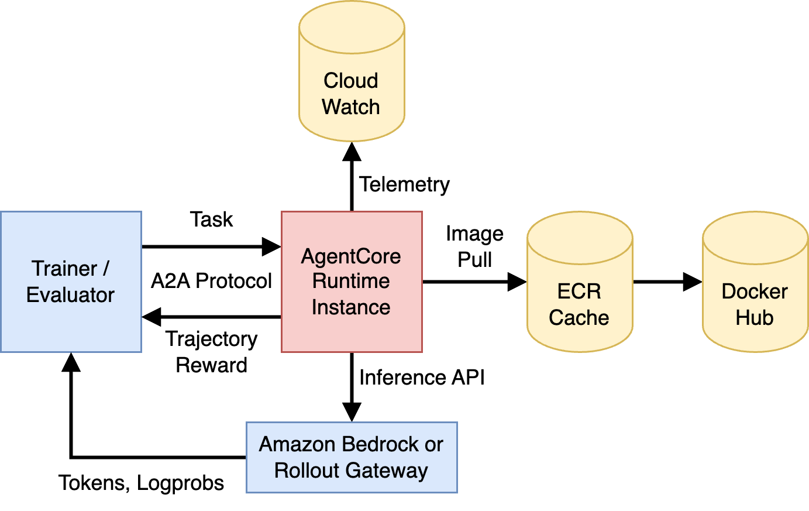
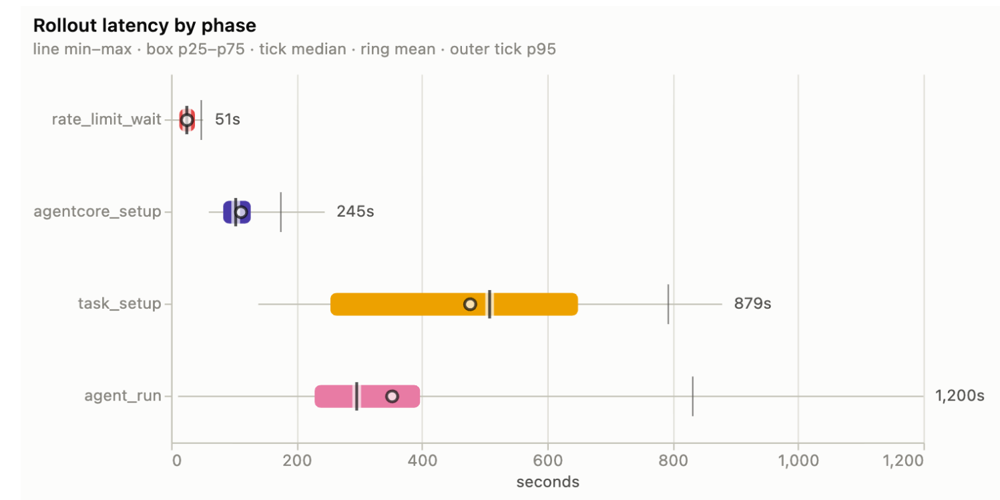
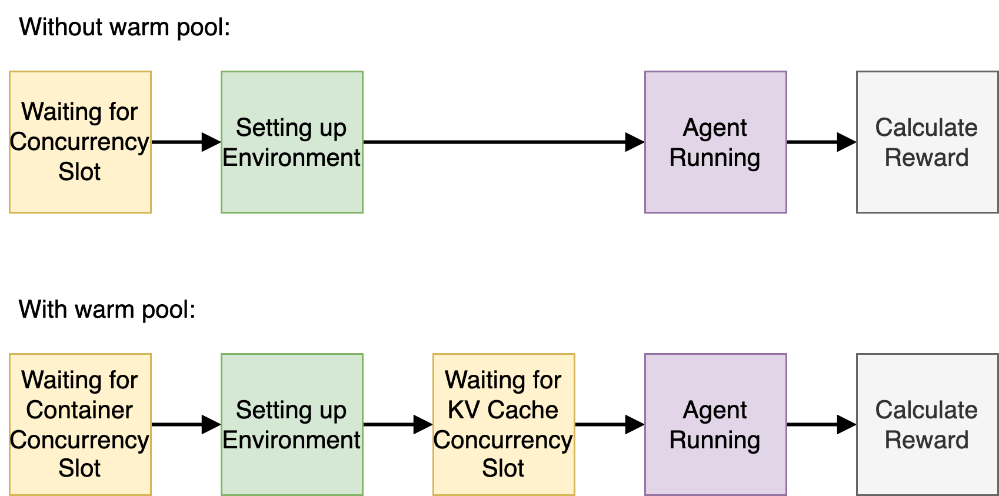
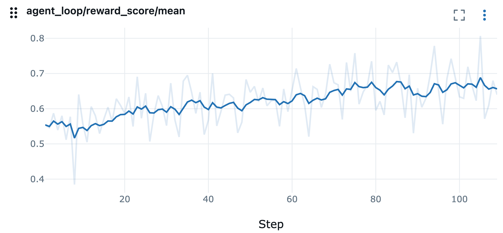

_By [Danylo Vashchilenko](https://github.com/hellodanylo) · October 13, 2026_

:::note[TL;DR]

* 🚀 We train Qwen3 Coder 30B on SWE Gym with GRPO and achieve +8.23pp pass@1
rate improvement on a difficulty-filtered subset of SWE Gym.
* 🚀 We achieve 1.20x inference RPM speedup by hiding the container and environment
setup latency with a two-stage pipeline.
* ✅ We run a cheap self-consistency check for the task verifier, and find that
~15% of tasks in SWE Gym are not aligned with the reward definition. We exclude them from training.
* 🍰 In an ablation, we find that revealing the hidden SWE Gym tests to Qwen3 Coder 30B
increases the fraction of tasks with reward variance (non-zero advantage) by 27%.
* ℹ️ We use AgentCore Runtime Instances and allocate sufficient compute and storage resources
for the SWE agent to execute CPU- and disk IO-intensive tasks.
* ℹ️ We leverage the AgentCore's support for A2A protocol to handle long-running tasks on the remote agent server.

:::

## Motivation and Results
Coding tasks and agents are on the intelligence frontier of the modern LLMs.
The industry is closely monitoring the SWE benchmark results,
such as those aggregated by [Artificial Analysis](https://artificialanalysis.ai/agents/coding-agents).

We implemented an SWE agent that can be used to solve tasks
from the [SWE Gym](https://github.com/SWE-Gym/SWE-Gym) dataset during RL training and evaluation.
In order to show the agent's effectiveness, we evaluate [Qwen3 Coder 30B](https://docs.aws.amazon.com/bedrock/latest/userguide/model-card-qwen-qwen3-coder-30b-a3b-instruct.html)
and [Claude Sonnet 4.6](https://docs.aws.amazon.com/bedrock/latest/userguide/model-card-anthropic-claude-sonnet-4-6.html), and then train Qwen3 Coder 30B
using AgentCore RL Toolkit.

## Agent Design

The agent's core loop is built with OpenHands SDK, which is one of the top-performing
harness SDKs benchmarked on [SWE Bench](https://www.swebench.com/).
We make three built-in tools available: a persistent shell, a file editor,
and a finish tool, which the agent can use to explicitly terminate the loop.

The SWE workflow consists of three stages: (1) setup (preparing the task's environment),
and (2) run (active LLM inference and tool execution), and (3) verification. During the setup stage,
the harness downloads the task-specific dependencies and code (see [Task Environment](#task-environment)).
During the run stage, we use [LiteLLM](https://docs.litellm.ai/) to support
a wide range of LLM servers, including Amazon Bedrock. Finally, during verification,
the harness executes a set of dataset-provided tests and compares their
pass/no-pass status to the expected outcome.

We use the [A2A protocol](https://a2a-protocol.org) to programmatically communicate
with the agent when its hosted on AgentCore Runtime.

During training and evaluation, the agents will need to access many images quickly,
which could be enough to hit a public registry's pull-rate limits.
The setup script pulls through an [ECR caching layer](https://docs.aws.amazon.com/AmazonECR/latest/userguide/pull-through-cache.html)
instead, so only the very first pull of a given task image goes out to the origin registry; every
rollout after that hits the ECR cache.

The task setup stage in SWE Gym is bound by disk IO throughput during image extraction,
while the agent run stage is bound by CPU during tool calling. Therefore, compute
and storage resources are important dimensions of the RL environment design.
We use [AgentCore Runtime Instances](https://docs.aws.amazon.com/bedrock-agentcore/latest/devguide/runtime-instances-how-it-works.html)
to provision c5.large EC2 instance (2 vCPU / 4 GiB) and configure its root EBS volume
with 600 MB/s of throughput and 2400 of IOPS. Without the capability to configure
the desired compute and storage resources, the task setup and the agent run
stages would be throttled by either CPU or disk IO, which would reduce the efficiency of RL training and evaluation.

## Hiding Setup Latency with Warm Pool

The following plot presents the breakdown of latency of different stages,
which shows that "Rate Limit Wait", "AgentCore Setup", and "Task Setup" can take
almost twice as much time as the Agent Run stage (LLM inference and tool calling, verifier script).

In a baseline implementation, each session acquires a concurrency slot, proceeds
to setup the environment, and then runs the agent. The implementation is inefficient,
because a session holds a concurrency slot against KV cache capacity but does
not actually use any KV cache capacity during the setup stage, which results
in low inference server utilization.

In order to hide the setup latency, we implement a two-stage pipeline, where containers
do not acquire a KV cache concurrency slot until the setup stage is finished.
The containers that finished setting up but do not have a KV cache slot are
in the warm pool. When container concurrency is higher than KV cache concurrency,
some containers will be fully ready when a KV cache concurrency slot becomes available,
making the setup latency hidden from the inference server's perspective.

In this report, the rollout batch size is 512,
and we only have enough KV cache capacity for 256 concurrent trajectories.
Since there is CPU capacity for 512 containers, we can keep up to 256 containers (=512-256)
in the warm pool. The following table shows performance comparison with and without the warm pool:

|Warm Pool Size|Avg Inference Concurrency|Avg Inference RPM|Inference Speedup|
|---|---|---|---|
|Zero (baseline)|116|1900||
|256 (new)|220|2276|1.20x|

We observe that hiding the setup latency increases the inference RPM by 1.20x.

## Task Environment

Each task in the dataset ships as a container image that has a working
Python environment and a checkout of the target repository at the buggy commit.
For security reasons, AgentCore Runtime is a very restricted environment that
prevents docker pull/run commands. Instead, the setup script directly downloads
the image's layers, flattens them into a plain root filesystem without invoking a
container runtime, and copies just the directories the agent actually needs (the
Python environment and the project's git worktree) into place, discarding the rest. In short,
the task environment's filesystem is merged in the agent's root filesystem.

Verifier script writes the task's new test coverage into the git worktree and
executes the test suite. This log carries the exact
markers the verifier's parser looks for. It maps the raw test output onto the specific
tests each task declares as "must be passing", resulting in single resolved/unresolved verdict.

Two baseline configurations exist to validate the verifier's alignment with the dataset.
The "oracle" baseline applies the dataset's golden patch and expects a resolved verdict;
the "noop" baseline does not modify any worktree files and expects an unresolved one.
If the oracle fails a task or the noop passes it, it's a sign that the verifier script
is not aligned with that task — a broken eval script, a flaky test, a bad golden patch, etc.
On SWE Gym dataset, we find that 2% of tasks pass their tests without any changes,
and ~16% of tasks do not pass their tests with the golden patch. These tasks are
excluded from training for efficiency.

## Baseline Evaluation

We evaluate the baseline capabilities on SWE Gym over 2438 tasks.
We set a timeout for the agent run stage to 30 minutes,
but keep the maximum context length unrestricted (1M for Sonnet, and 256K for Coder).

The following table presents the trajectory shapes produced by each model. We observe
that Sonnet's response length (includes thinking) is ~3.5x longer than Coder's. The higher
effort level leads to 7% of Claude's trajectories being aborted due to the 30-minute timeout,
which Coder never exceeds.

| Model | Timeout Abort Ratio | Context Length (Thousands) | Response Length (Thousands) | Turns |
|---|---|---|---|---|
|Qwen3 Coder 30B|0%|40.57|11.39|48.40
|Claude Sonnet 4.6|7%|75.54|37.01|61.37|

Next, we compare the pass rates for each model. We run 4 attempts on each
task in the dataset. We observe that Claude has 21pp higher pass@1 rate. During
GRPO training, we want mixed@n ratio to be high to avoid wasting compute on
zero-reward trajectories. Since Coder's mixed@4 is only 16%, we will exclude
tasks with no reward variance before training to improve rollout efficiency.

| Model | pass@1 | all-pass@4 | all-fail@4 | mixed@4 | mixed@4 count
|---|---|---|---|---|---|
| Qwen3 Coder 30B | 0.275 | 0.187 | 0.651 | 0.162 | 395
| Claude Sonnet 4.6 | 0.485 | 0.349 | 0.381 | 0.270 | 685

Metric definitions:
* pass@1 = average pass rate across all attempts
* all-pass@4 = ratio of tasks where all attempts passed
* all-fail@4 = ratio of tasks where all attempts failed
* mixed@4 = ratio of tasks where >=1 attempts failed and >=1 attempts passed
* mixed@4 count = same as ratio, but just the count of tasks

## Training Results

We train Qwen3 Coder 30B with GRPO, 16 trajectories per task, and a training
batch size of 32 (mini batch size of 16). We limit the context length to 64K
for training efficiency. We use a subset of 332 tasks using the mixed@4 filter.

The final mean verifier reward was 0.6398, up from 0.5575 at step 1:
an absolute improvement of 8.23 percentage points over 109 training steps.
The following table compares the metrics from the first and the last training step. We
observe that trajectories became ~18% longer over the training run.

| Metric | Step 1 | Step 109 | Change |
|---|---:|---:|---:|
| pass@1 | 0.5575 | 0.6398 | +8.23 pp |
| Context Length (Thousands) | 39.8 | 46.8 | +17.6% |
| Response Length (Thousands) | 10.2 | 12.1 | +19.1% |
| Turns | 49.8 | 58.8 | +18.1% |

## Qualitative Analysis of Behavior Changes during Training

Aggregate pass-rate improvement confirms that training on this dataset works,
but it does not say *what* changes in the agent's behavior along the way. We
used Claude Opus 5 to analyze a sample of tasks with the highest delta of pass@1
between the first and the last training epoch. The following patterns emerged:

- **Root-cause localization.** This was rarely the bottleneck at any point in training.
  Even in the first epoch, the agent reliably found the right file or the right function
  within the first few tool calls, in every case examined.
- **Fix scope and correctness.** This is where early agents actually lost points:
  editing the right file but reading state off the wrong object, reusing a
  superficially-similar mechanism that doesn't actually apply to the specific case at
  hand, or solving a plausible-sounding but subtly different problem than the one being
  asked. In the last epoch, agents converged on the narrower, correctly-scoped fix far more consistently,
  often after explicitly checking how an analogous, already-solved case in the
  same codebase handled the identical shape of problem.
- **Self-verification discipline.** This is what changed most between the first
  and the last epoch. Early agents that hit an ambiguous or failing signal from
  their own reproduction script routinely rationalized past it — declaring success
  while their own tool output still showed an error — rather than digging in.
  Later agents hit the same dead ends just
  as often, but reliably responded by inspecting real intermediate values, building a
  differential test against a known-good case, and re-running the test suite.
- **Recovery from a bad first attempt.** The clearest behavioral shift wasn't avoiding
  wrong turns — later agents still took some of the exact same wrong turns earlier
  ones did. It was what happened *next*: catching the mistake through re-verification
  and pivoting to a working fix.

In short, the pass@1 gained during training can be attributed to the agent's
improved ability to propose the right fix, thoroughly self-verify it,
and successfully recover from wrong attempts.

## Ablation: Revealing the hidden tests to the agent

The original intention of authors of SWE Gym datasets was to hide the new tests
from the agent until it finishes implementing the fix based on a short English
description of the problem. This simulates a scenario where the user
provides the agent with task description and then verifies the agent's work with the
tests that the user develops independently from the agent. However, when reviewing
a sample all-fail@4 tasks, we found that some tasks have English descriptions that
are not aligned with the hidden tests, making solving the task very hard or even impossible.

As an ablation, we test the scenario, where the agent can see
both the English description of the problem as well as the hidden new tests that
are used to verify the solution. The agent can read and execute the new tests,
but any changes to them are discarded before calculating the final reward.

### Qwen3 Coder 30B

The following table presents the trajectory shape and pass rate results
for the Qwen3 Coder 30B model. We observe a very small pass@1 improvement (4pp),
but a significant mixed@4 improvement, resulting in 24% more tasks with
non-zero reward variance. This is attributed to 6.3pp reduction in all-fail@4
tasks. We also observe that trajectory shapes did not change.

| Metric | Tests hidden | Tests shown | Change |
|---|---:|---:|---:|
| Context Length (Thousands) | 40.57 | 42.21 | |
| Response Length (Thousands) | 11.39 | 11.41 | |
| Turns | 48.40 | 49.20 | |
| pass@1 | 0.275 | 0.315 | +4.0 pp |
| all-pass@4 | 0.187 | 0.206 | |
| all-fail@4 | 0.651 | 0.588 | -6.3 pp |
| mixed@4 | 0.162 | 0.206 | |
| mixed@4 count | 395 | 502 | +27% |

We conclude that revealing the hidden tests could make the dataset more
valuable for training of Qwen3 Coder 30B, by reducing the fraction of tasks
that are too difficult. However, Coder can not reliably take advantage of the additional
information present in the revealed tests. This is consistent with the qualitative
issues discussed in "Self-verification discipline" section.

### Claude Sonnet 4.6

The following table presents the trajectory shape and pass rate results
for Claude Sonnet 4.6 model. We observe that Sonnet gains ~27pp in pass@1
and spends 40% fewer response tokens.

| Metric | Tests hidden | Tests shown | Change |
|---|---:|---:|---:|
| Context Length (Thousands) | 75.54 | 58.55 | -22.5% |
| Response Length (Thousands) | 37.01 | 21.97 | -40.6% |
| Turns | 61.37 | 41.41 | -32.5% |
| pass@1 | 0.485 | 0.759 | +27.4 pp |
| all-pass@4 | 0.349 | 0.680 | |
| all-fail@4 | 0.381 | 0.188 | -19.3 pp |
| mixed@4 | 0.270 | 0.132 | |
| mixed@4 count | 685 | 321 | -53% |

We conclude that revealing tests helps Claude both reliably solve tasks
that were already somewhat solvable, as well as solve tasks that were not
previously solvable. The reduction in response length suggests that
Claude perceived the task with revealed tests to be significantly simpler.
