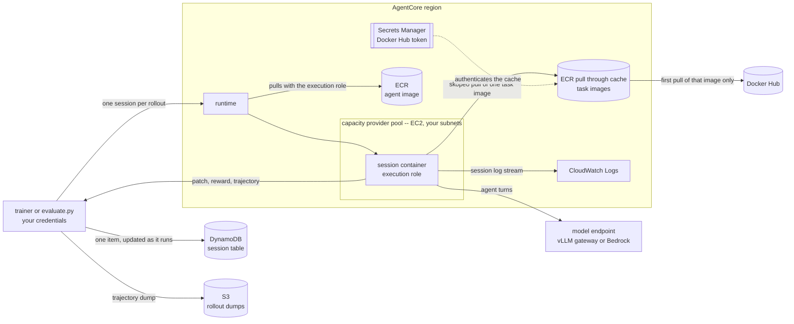

# SWE Agent

## Structure of this folder
* config.py / config.toml -- this recipe's own config, read by every script here
* deploy.py -- builds the agent image, tests it, and deploys prerequisite AWS resources
* verify_image.py -- runs the server-side unit tests inside a built agent image
* preprocess.py -- builds the dataset .parquet, whole or filtered by eval runs
* evaluate.py -- runs batch evaluation against the deployed agent
* rollout_batch.py -- batch rollout that evaluate.py drives: endpoints, driver, report
* rollout_report.py -- loads a run's rollout records back and reduces them to stats
* analyze.py -- reports any run's stats from its rollout records in DynamoDB
* image -- tools for the agent's docker image build
* src -- implements `lifecycle` protocol and connects OpenHands harness to it
* tests -- unit tests, run in two places: see below
* local -- gitignored: a report file per evaluation run, a snapshot of the records

## Prerequisites
You have to acquire access to the following before proceeding:
* ECR repository for storing this agent's image after building it
* S3 bucket for storing this agent's rollout trajectories
* Docker Hub access token (a read-only PAT is enough) for pulling dataset-specific images
* VPC subnet and security group that the agent container will use

## Agent Resources Setup
1. Copy `config.example.toml` to `config.toml` and fill in your account's values
2. Build the agent image and deploy the AWS resources: `./deploy.py`

### What deploy.py creates

Everything is looked up by name in `config.toml`, in one region (`agentcore.region`),
and created or updated as needed:

    runtime                  agentcore.runtime_name
      |-- agent image        docker_repo:image_tag        (your ECR repo, built+pushed here)
      |-- execution role     execution_role_name          (from iam_policy.py)
      `-- capacity provider  capacity_provider.name       (your subnets + security groups)
            |-- operator role      AgentCore launches the pool's EC2 instances with it
            `-- instance profile   the instances carry it, for system logs

    pull through cache rule  docker_hub.cache_prefix      (task images, same region)
      `-- secret             docker_hub.secret_name       (your Docker Hub token)

    session table            storage.dynamodb_table       (one item per rollout)
    rollout bucket           storage.rollout_output_s3    (yours; deploy.py never touches it)

**Runtime** -- what a rollout actually starts a session on. It names the image, the
execution role and the pool, and deploy.py repoints it at each roll (the superseded
version is deleted).

**Execution role** -- the identity of the container. `iam_policy.py` is its whole
permission set after a deploy, so a grant added by hand in the console is reverted;
edit `iam_policy.py` instead. Its ECR grants cover exactly two repositories:
`docker_repo`, because AgentCore pulls the *agent* image with this role, and
`cache_prefix`, for the task images. One role serves every runtime this recipe
deploys.

**Capacity provider** -- the EC2 pool. Its compute configuration is immutable,
including its two roles and `ssh_key_name`, so `name` is effectively a version: to
change `instance_type`, `root_throughput`, subnets or the key pair, bump the name and
deploy, which creates the new pool and repoints the runtime. An unchanged name is
reported and left alone. The two pool roles have fixed names and carry AWS managed
policies, so permissions AgentCore adds arrive without a deploy; neither grants the
agent's code anything.

**Pull through cache** -- task images come from Docker Hub, where a run's few thousand
pulls hit the rate limit, so they are pulled through our own ECR registry. A cache is
regional and must be in the region the sessions run in; caching for a second region
means deploying this recipe there. Three modes:

* `username` + `access_token` in `[docker_hub]`: written to the secret, rule created
  or repointed at it
* credentials omitted: the secret keeps its current value -- the redeploy that needs
  no token on disk
* `secret_name` omitted too: the rule is only validated, for a cache someone else owns

deploy.py always validates the rule, because a stale token otherwise surfaces much
later as task images that "do not exist".

**Session table** -- one item per rollout, keyed by `session_id`, written through as
the rollout progresses by the trainer and by `evaluate.py` alike, with the ambient
credentials rather than the execution role. That is what makes a run watchable in
flight and analysable afterwards, so give the trainer's `.env` the same table name.
deploy.py creates it on-demand with the `experiment_sessions` index the analysis
needs, adds that index to a table that predates it, and refuses a table keyed
differently rather than rebuilding it. The table accumulates every run ever done.

The S3 bucket is the one resource deploy.py does not create: a bucket name is global,
and retention of rollout dumps is an account's decision, not this recipe's.

### What a rollout does with them

Two things to read off it. The container never touches DynamoDB or S3 -- the driver
writes both with your own credentials, which is why `iam_policy.py` grants neither,
and why a rollout still has a record when its container dies. And Docker Hub is
reached by ECR, not by the container, and only for a task image nobody has pulled
before: that pull is the slow one, and the one a stale token or a missing
`ecr:BatchImportUpstreamImage` breaks.

### Rolling a new image

`./deploy.py` is idempotent and is also the command for every later roll:

    ./deploy.py                     # build, test, push, repoint the runtime
    ./deploy.py --image-tag r12     # build and roll a one-off tag
    ./deploy.py --skip-build        # repoint at an image already in the registry
    ./deploy.py --skip-tests        # push what it built without testing it

The build runs first, so a failed build cannot leave the runtime on a tag that does
not exist.

Between the build and the push, the harness's server-side unit tests run *in the image
just built* (`verify_image.py`): a container is started from it with `tests/`
bind-mounted read-only at `/agent/tests`, pytest installed into `/agent/.venv` for the
run only, and `iam_policy_test.py` excluded as the one host-side test. A failure raises
before the push, so a harness that does not import cannot reach the registry, let alone
a runtime. The image is the only environment where these tests' imports resolve, and
running them there means the artifact deployed is the artifact tested. `--skip-tests`
pushes anyway; `--skip-build` skips the tests too, since nothing was built locally to
run them in.

Put the three ARNs printed at the end into the project `.env`, which is
where the trainer reads them from. `evaluate.py` needs none of them -- it resolves the
runtime and the pool from the names in `config.toml`, so an eval always hits whatever
was deployed last.

## Dataset preparation
0. Install a dataset-specific grader (see images/install_graders.sh)
1. Preprocess the whole dataset into .parquet format: `./preprocess.py`, which writes
   `local/<dataset>.parquet` -- the same path `evaluate.py` reads its slices from.
2. Run batch evaluation with (oracle, noop, and openhands agents)
3. Re-run `preprocess.py` with those runs named, to create the difficulty-filtered subset

Step 3 is the same script with a filter per run, each dropping the tasks that run
proves are not worth training on -- ones the noop agent already resolves, ones the
oracle cannot, and ones outside the policy's pass-rate window. Every filter also drops
a task that aborted (container death, timeout) even once in its run: in training that
costs a whole group's advantage, not one rollout.

    ./preprocess.py --output local/<dataset>_challenged.parquet \
        --noop-experiment <run> --oracle-experiment <run> --model-experiment <run>

It prints what each filter dropped and what is left. `--dry-run` prints only that,
without building the parquet, which is the cheap way to try a different window
(`--min-pass-rate` / `--max-pass-rate`).

An experiment name here is the name the run recorded its sessions under, and the
per-task pass rates are read from the session table. Re-running a name does not
overwrite what the previous run said: pass `<name>@<start-at prefix>` to filter
by a run other than that name's latest.

Beside the parquet it writes `<output>.lineage.json`: which runs each filter came from
(name, start timestamp, rollout count), the pass-rate window, how many tasks each rule
dropped, and which tasks that run never measured. The parquet itself says none of this,
and "which data is this" is the first question asked of a training run six weeks later.

## Reading a run's results

    ./analyze.py <experiment>              # the latest run of that name
    ./analyze.py <experiment> --runs       # which runs the name has
    ./analyze.py <experiment> --start-at 2026-09-03T19 --output local/r5.json

The stats `evaluate.py` prints when a run finishes, for any run, computed the same way
(`rollout_report.py`) but from the session table. Every rollout
persists its own record as it goes, so this reports a run that is still in flight, one
whose driver exited long ago, and a *training* run, which writes the same records and
no report file at all. It needs credentials to read the table named in `[storage]`, and
nothing else.

Reward and pass@k are named; everything else is generic -- one row per numeric field
the rollout records happened to carry, so a metric added to the agent is summarized
here without this script learning about it. Aborted rollouts count against pass@k (a
task the run failed to answer) but are left out of the distributions, where a container
that never ran would drag every timing down.

### Where the tests run

`tests/` is split by which environment its imports exist in, and the split is not
cosmetic -- neither half runs in the other's:

* `noop_agent_test.py`, `open_hands_agent_test.py`, `strands_agent_test.py` cover the
  harness inside the container. They import `swe_agent_server` (and through it
  `agentcore_rl_toolkit.rollout_session.wire`, openhands, strands), which exist only
  in the image's `/agent/.venv`. `deploy.py` runs them in the image it just built --
  see [Rolling a new image](#rolling-a-new-image) -- or `./verify_image.py <image>`
  runs them against an image you already have.
* `iam_policy_test.py`, `rollout_batch_test.py` and `rollout_report_test.py` cover the
  host side -- the execution role (`config`, `iam_policy`) and the eval harness
  (`rollout_batch`, `rollout_report`) -- which needs `config.toml` and the toolkit's own
  dev environment, none of it present in the image. Run them from the toolkit root, named:
  `uv run pytest examples/openhands_swe_agent/tests/{iam_policy,rollout_batch,rollout_report}_test.py`.

Pointing a host-side pytest at the whole directory collects all six and errors on the
three container ones; that is the split, not a break.
